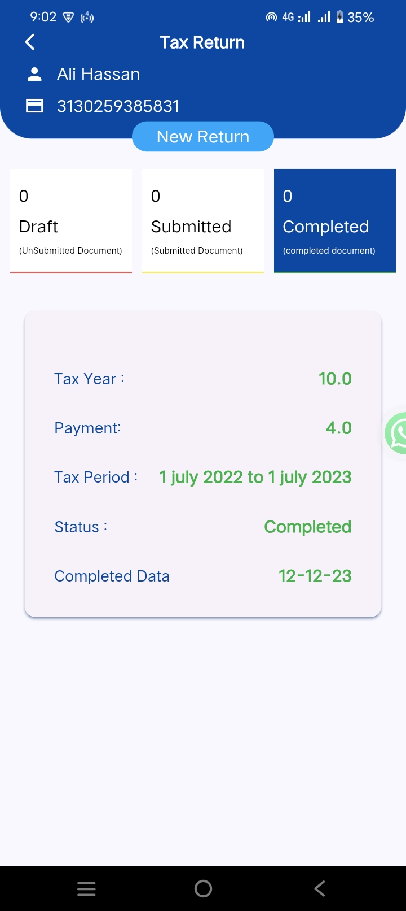

# TaxTip

<div align="center">
  <h1>
    <br/>
    TaxTip
  </h1>
  <h3>Personal Tax Management & Filing App</h3>
</div>

<p align="center">
    <a href="https://github.com/" target="_blank">
        
    </a>
    <a href="APK/app-release.apk" target="_blank">
        
    </a>
</p>

---

## 📱 Official App Links

- **APK Download:** [app-release.apk](APK/app-release.apk)

---

## 📖 About TaxTip

TaxTip is a comprehensive tax management and filing app designed for individuals and small businesses. With an intuitive interface and robust features, TaxTip empowers users to manage their tax-related information, calculate liabilities, track assets, and file returns efficiently.

### Key Features

- **User Profile Management:** Update and manage your personal and business information securely.
- **Asset Tracking:** Add, edit, and view various asset types including property, business capital, foreign assets, mutual funds, and vehicles.
- **Income & Expense Management:** Record multiple income sources and expense categories for accurate tax calculations.
- **Tax Calculators:** Built-in calculators for business, salary, and other tax scenarios.
- **Liabilities Management:** Track and manage liabilities with detailed breakdowns.
- **Tax Saving & Deduction:** Explore and record eligible tax-saving investments and deductions.
- **Summary & Analytics:** Visual summaries and reports for assets, liabilities, income, and tax returns.
- **Secure Authentication:** Google Sign-In and Firebase Authentication support.
- **Cloud Sync:** All data is securely synced with Firebase Cloud Firestore.
- **PDF Export:** Export summaries and reports for your records.
- **Modern UI:** Clean, responsive, and user-friendly design.

> **References:**  [APK Download](APK/app-release.apk)

---

## 📌 Overview

**TaxTip** is a Flutter-based tax management app that helps users track assets, income, expenses, liabilities, and file tax returns with ease. It provides analytics, calculators, and secure cloud sync.

## 🚀 Tech Stack

- **Flutter** (Cross-platform UI Framework)
- **GetX** (State Management)
- **Firebase** (Authentication, Firestore, Storage)
- **Cloud Firestore** (Data Storage)
- **PDF Generation**
- **Image Picker** (Profile & Asset Images)
- **Local Storage** (Shared Preferences)

## 🔑 Key Features

- ✅ **User Profile**: Manage and update user info
- ✅ **Asset Management**: Add, edit, and view assets
- ✅ **Income & Expense Tracking**: Record and categorize transactions
- ✅ **Tax Calculators**: Salary, business, and more
- ✅ **Liabilities Tracking**: Manage debts and obligations
- ✅ **Tax Saving & Deduction**: Record eligible investments
- ✅ **Summary & Analytics**: Visual reports and summaries
- ✅ **PDF Export**: Export reports and summaries
- ✅ **Notifications**: Reminders for important actions
- ✅ **Cloud Sync**: Secure data backup with Firebase
- ✅ **Modern UI**: Light/Dark theme support

## 📸 App Screenshots

<div align="center">
  <h4>✨ <b>App Walkthrough</b> ✨</h4>
  
</div>

### 🏠 Home & Navigation
<div align="center">
  
  
  
  
  
</div>

### 🔐 Authentication
<div align="center">
  
  
  
  
</div>

### 👤 User & About
<div align="center">
  
  
  
  
</div>

### 🏢 Asset Management
<div align="center">
  
  
  
  
</div>

### 💸 Income & Expense
<div align="center">
  
  
  
  
  
  
  
  
  
</div>

### 🏦 Liabilities & Payments
<div align="center">
  
  
  
  
</div>

### 📊 Tax, Returns & Summary
<div align="center">
  
  
  
  
  
  
  
  
  
  
</div>

### 🧮 Calculators & Advanced
<div align="center">
  
  
  
  
  
  
</div>

## 📁 Project Structure

```
lib/
├── controllers/           # State management controllers
├── models/                # Data models
├── utils/                 # Utility widgets and helpers
├── views/                 # UI screens (Home, Login, Assets, etc.)
├── main.dart              # App entry point
```

## 📱 Download APK

You can download the latest APK from the [APK folder](APK/) or directly:
- [app-release.apk](APK/app-release.apk)

## 🔧 Configuration

### Firebase Setup
1. Create a new Firebase project
2. Enable Authentication and Firestore
3. Download `google-services.json` and place it in `android/app/`

### Environment Variables
If needed, create a `.env` file in the root directory with your Firebase configuration:
```
FIREBASE_API_KEY=your_api_key
FIREBASE_PROJECT_ID=your_project_id
FIREBASE_MESSAGING_SENDER_ID=your_sender_id
FIREBASE_APP_ID=your_app_id
```

## 🚀 Features Overview

- **Asset, Income, and Expense Management**
- **Tax Calculators & Analytics**
- **Liabilities & Deductions**
- **PDF Export**
- **Notifications**
- **User Profiles**
- **Cloud Sync**
- **Modern UI**

## 👥 Contributors

<div align="center">
  <h3>Project Contributors</h3>
</div>

<table align="center">
  <tr>
    <td align="center">
      
      <br />
      <sub><b>ALI HASSAN</b></sub>
    </td>
    <td align="center">
      
      <br />
      <sub><b>Mohsin Ismail</b></sub>
    </td>
  </tr>
</table>

<div align="center">
  <h4>🌟 Special Thanks to All Contributors 🌟</h4>
  <p>This project wouldn't be possible without the dedication and expertise of our amazing team.</p>
</div>

---

<p align="center">
   Made with ❤️ by the 7 Skies Solution Team using Flutter and Firebase
</p>
